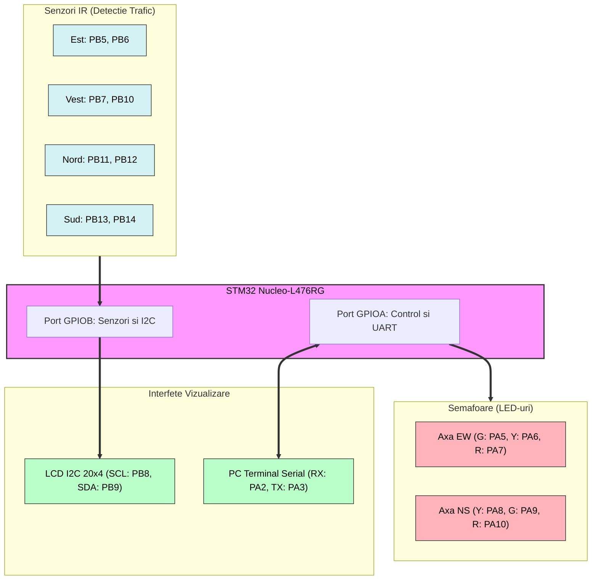

## Hardware Diagram

```mermaid
graph TD
    %% Definire stiluri pentru claritate
    classDef mcu fill:#f9f,stroke:#333,stroke-width:2px,color:black;
    classDef input fill:#d4f1f4,stroke:#333,stroke-width:1px,color:black;
    classDef output fill:#ffb3ba,stroke:#333,stroke-width:1px,color:black;
    classDef comm fill:#baffc9,stroke:#333,stroke-width:1px,color:black;

    %% Nodul Central: Microcontrolerul
    subgraph MCU ["STM32 Nucleo-L476RG"]
        direction TB
        PORTA["Port GPIOA: Control si UART"]
        PORTB["Port GPIOB: Senzori si I2C"]
    end
    class MCU mcu;

    %% Bloc Senzori IR (Intrări)
    subgraph Sensors ["Senzori IR (Detectie Trafic)"]
        direction LR
        E_Sens["Est: PB5, PB6"]:::input
        W_Sens["Vest: PB7, PB10"]:::input
        N_Sens["Nord: PB11, PB12"]:::input
        S_Sens["Sud: PB13, PB14"]:::input
    end

    %% Bloc Semafoare LED (Ieșiri)
    subgraph LEDs ["Semafoare (LED-uri)"]
        direction LR
        EW_LEDs["Axa EW (G: PA5, Y: PA6, R: PA7)"]:::output
        NS_LEDs["Axa NS (Y: PA8, G: PA9, R: PA10)"]:::output
    end

    %% Bloc Afișaj și Monitorizare (Interfețe)
    subgraph Monitor ["Interfete Vizualizare"]
        LCD["LCD I2C 20x4 (SCL: PB8, SDA: PB9)"]:::comm
        PC["PC Terminal Serial (RX: PA2, TX: PA3)"]:::comm
    end

    %% Conexiuni fizice sigure
    Sensors ==> PORTB
    PORTA ==> LEDs
    PORTB ==> LCD
    PORTA <==> PC
```