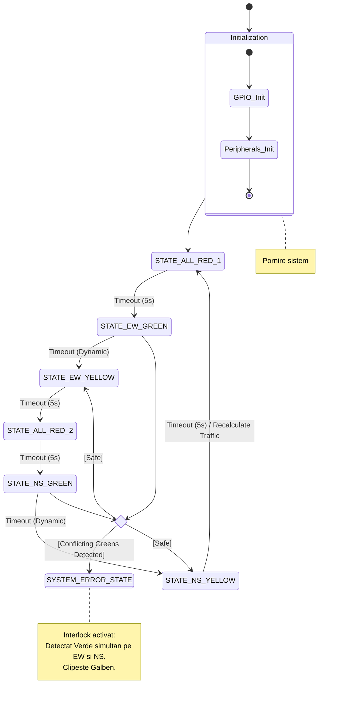

## FSM State Diagram

```mermaid
stateDiagram-v2
    %% Definire culori pentru stări
    classDef green fill:#8f8,stroke:#333,stroke-width:1px;
    classDef yellow fill:#ff8,stroke:#333,stroke-width:1px;
    classDef red fill:#f88,stroke:#333,stroke-width:1px;
    classDef error fill:#f00,stroke:#333,stroke-width:2px,stroke-dasharray: 5 5,color:white;

    [*] --> Initialization

    state Initialization {
        [*] --> GPIO_Init
        GPIO_Init --> Peripherals_Init
        Peripherals_Init --> [*]
    }

    Initialization --> STATE_ALL_RED_1
    note right of Initialization : Pornire sistem

    %% Logica Normală de Funcționare
    state STATE_ALL_RED_1 ::: red
    state STATE_EW_GREEN ::: green
    state STATE_EW_YELLOW ::: yellow
    state STATE_ALL_RED_2 ::: red
    state STATE_NS_GREEN ::: green
    state STATE_NS_YELLOW ::: yellow

    STATE_ALL_RED_1 --> STATE_EW_GREEN : Timeout (5s)
    STATE_EW_GREEN --> STATE_EW_YELLOW : Timeout (Dynamic)
    STATE_EW_YELLOW --> STATE_ALL_RED_2 : Timeout (5s)
    STATE_ALL_RED_2 --> STATE_NS_GREEN : Timeout (5s)
    STATE_NS_GREEN --> STATE_NS_YELLOW : Timeout (Dynamic)
    STATE_NS_YELLOW --> STATE_ALL_RED_1 : Timeout (5s) / Recalculate Traffic

    %% Mecanism de Siguranță
    state "SYSTEM_ERROR_STATE" as ERROR ::: error
    note right of ERROR
        Interlock activat:
        Detectat Verde simultan pe EW si NS.
        Clipeste Galben.
    end note

    state Check_Interlock <<choice>>

    STATE_EW_GREEN --> Check_Interlock
    STATE_NS_GREEN --> Check_Interlock
    Check_Interlock --> ERROR : [Conflicting Greens Detected]
    Check_Interlock --> STATE_EW_YELLOW : [Safe]
    Check_Interlock --> STATE_NS_YELLOW : [Safe]
```